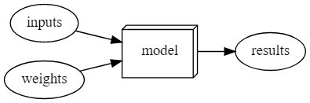

1. Những thứ cần thiết để sử dụng Học sâu
- Không cần quá nhiều kiến thức chuyên sâu về toán, có thể nói rằng chỉ cần nắm vững kiến thức toán ở trung học phổ thông
- Không cần có quá nhiều dữ liệu, ví dụ như trong bài giảng đề cập đến mốc 50 mẫu
- Không cần đến những máy tính đắt tiền, hầu như các công cụ đều được cung cấp sẵn
- Về những cơ bản không cần đến trình độ tiến sĩ mới có thể sử dụng Học sâu
2. Kể tên các lĩnh vực mà học sâu hiện là tốt nhất trên thế giới.
- Xử lý ngôn ngữ tự nhiên
- Thị giác máy
- Dược phẩm
- Sinh học
- Robotics
- Hệ thống gợi ý
- ....

3. Tên của thiết bị đầu tiên dựa trên nguyên tắc của nơ-ron nhân tạo là gì?
- Thiết bị đầu tiên được tạo nên dựa trên nguyên tắc của nơ-ron nhân tạo là Threshold Logic Unit (TLU), hoặc Linear Threshold Unit được đề xuất bởi Warren McCulloch và Walter Pitts vào năm 1943. Mô hình được nhắm mục tiêu cụ thể như một mô hình tính toán của "mạng lưới thần kinh" trong não. Là một hàm truyền, nó sử dụng một ngưỡng, tương đương với việc sử dụng hàm bước Heaviside. Ban đầu, chỉ một mô hình đơn giản được xem xét, với đầu vào và đầu ra nhị phân, một số hạn chế về trọng số có thể có và giá trị ngưỡng linh hoạt hơn. (Wiki)

4. Dựa trên cuốn sách cùng tên, các yêu cầu đối với xử lý phân tán song song (PDP, parallel distributed processing) là gì?
- Hệ thống xử lý phân tán song song được mô tả bao gồm một tổ hợp các bộ phận xử lý (processing units), gồm một hoặc nhiều hơn các bộ phận trong các loại sau: state of activation, output function, pattern of connectivity, propagation rule, activation rule, learning rule từ đó tấc động đến môi trường. Hệ thống này được kì vọng có thể xử lý tất cả các công việc có thể có trên thế giới này.

5. Hai hiểu lầm lý thuyết đã cản trở lĩnh vực mạng nơ-ron là gì?
- Năm 1969, Marvin Minsky và Seymour Papert trong cuốn sách nổi tiếng Perceptrons đã chứng minh rằng không thể ‘học’ được hàm số XOR khi sử dụng perceptron. Phát hiện này làm choáng váng giới khoa học thời gian đó (bây giờ chúng ta thấy việc này khá hiển nhiên). Perceptron được chứng minh rằng chỉ hoạt động nếu dữ liệu là có thể tách được tuyến tính. Cùng với đó, dù họ đã chứng minh trong cùng một cuốn sách rằng các lớp bổ sung có thể giải quyết vấn đề này, chỉ có phát biểu đầu tiên được công nhận, dẫn đến sự bắt đầu của mùa đông AI đầu tiên.
- Vào những năm 1980, các mô hình có hai lớp đã được khám phá. Về mặt lý thuyết, có thể tính gần đúng bất kỳ hàm toán học nào bằng cách sử dụng hai lớp tế bào thần kinh nhân tạo. Tuy nhiên, trong thực tế, các mạng này quá lớn và quá chậm. Mặc dù nó đã được chứng minh rằng việc thêm các lớp bổ sung đã cải thiện hiệu suất, nhưng thông tin chi tiết này đã không được thừa nhận và mùa đông AI thứ hai đã bắt đầu. Trong thập kỷ qua, với sự gia tăng khả năng cung cấp dữ liệu và những cải tiến trong phần cứng máy tính (cả về hiệu suất CPU nhưng quan trọng hơn là về hiệu suất GPU), mạng thần kinh cuối cùng cũng phát huy hết tiềm năng của nó.

6. GPU là gì?
- GPU là viết tắt của Graphics Processing Unit (hay còn gọi là card đồ họa). Máy tính tiêu chuẩn có nhiều thành phần khác nhau như CPU, RAM, v.v. Trong đó CPU, hoặc bộ xử lý trung tâm, là đơn vị cốt lõi của tất cả các máy tính tiêu chuẩn và chúng thực hiện các lệnh tạo nên chương trình máy tính. Trong khi đó, GPU là đơn vị chuyên dụng để hiển thị đồ họa, đặc biệt là đồ họa 3D trong các trò chơi máy tính hiện đại. Các tối ưu hóa phần cứng được sử dụng trong GPU cho phép nó xử lý hàng nghìn tác vụ cùng lúc. Và thật ngẫu nhiên, những tối ưu hóa này cho phép chúng ta chạy và đào tạo mạng thần kinh nhanh hơn hàng trăm lần so với một CPU thông thường dù rất mạnh nhưng lại có quá ít lõi để có thể xử lý song song.

7. Mở một notebook và thực hiện một cell có chứa: 1 + 1. Điều gì xảy ra?
- Trong Máy tính xách tay Jupyter, chúng ta có thể tạo các ô mã và chạy mã theo cách tương tác. Khi chúng tôi thực thi một ô chứa một số mã (trong trường hợp này là: 1 + 1), mã được chạy bởi Python và kết quả được hiển thị bên dưới ô mã (trong trường hợp này là: 2).

8. Theo dõi từng cell của phiên bản rút gọn của notebook cho chương này. Trước khi thực hiện từng cell, hãy đoán xem điều gì sẽ xảy ra.
- => Xem notebook
9. Hoàn thành phần mở rộng của Jupyter Notebook cung cấp trong bài
- => Xem notebook

10. Tại sao khó sử dụng chương trình máy tính truyền thống để nhận dạng hình ảnh trong các file ảnh?
- Đối với con người chúng ta, thật dễ dàng để xác định hình ảnh trong một bức ảnh, chẳng hạn như xác định mèo và chó trong một bức ảnh. Điều này là do, trong tiềm thức, bộ não của chúng ta đã học được những đặc điểm nào xác định một con mèo hay một con chó chẳng hạn. Nhưng thật khó để xác định các quy tắc thiết lập cho một chương trình máy tính truyền thống để nhận ra một con mèo hay một con chó. Bạn có thể nghĩ ra quy tắc chung để xác định xem ảnh có mèo hay chó không? Bạn sẽ mã hóa nó như một chương trình máy tính như thế nào? Điều này rất khó vì mèo, chó hoặc các vật thể khác có rất nhiều hình dạng, kết cấu, màu sắc và các tính năng khác, và gần như không thể mã hóa thủ công này trong một chương trình máy tính truyền thống.

11. Ý của Samuel là gì khi nói về "weight assignment"?
- "Chỉ định trọng số" ("weight assignment") đề cập đến các giá trị hiện tại của các tham số mô hình. Arthur Samuel đề cập thêm về một “phương tiện tự động để kiểm tra tính hiệu quả của bất kỳ phép gán trọng số hiện tại nào” (“automatic means of testing the effectiveness of any current weight assignment”) và “cơ chế thay đổi việc gán trọng lượng để tối đa hóa hiệu suất” ("mechanism for altering the weight assignment so as to maximize the performance"). Điều này đề cập đến việc đánh giá và đào tạo mô hình để có được một tập hợp các giá trị tham số tối đa hóa hiệu suất của mô hình.

12. Thuật ngữ nào chúng ta thường sử dụng trong học tập sâu cho cái mà Samuel gọi là "weights"?
Thay vào đó, chúng tôi sử dụng các thuật ngữ tham số. Trong học tập sâu, thuật ngữ "trọng số" có một ý nghĩa riêng biệt. (Mạng nơron có nhiều tham số khác nhau mà chúng tôi phù hợp với dữ liệu của mình. Như được trình bày trong các chương sắp tới, hai loại tham số mạng nơron là trọng số và độ lệch)

13. Vẽ một bức tranh tóm tắt quan điểm của Samuel về mô hình học máy.

14. Tại sao khó hiểu tại sao mô hình học sâu lại đưa ra một dự đoán cụ thể?
- Đây là một chủ đề được nghiên cứu nhiều được biết đến như diễn giải cách thức hoạt động cũng như hiệu quả của các mô hình học sâu. Các mô hình học sâu khó hiểu một phần do tính chất “sâu” của chúng. Hãy nghĩ về một mô hình hồi quy tuyến tính. Đơn giản, chúng ta có một số biến / dữ liệu đầu vào được nhân với một số trọng số, cho chúng ta kết quả đầu ra. Chúng ta có thể hiểu biến nào quan trọng hơn và biến nào ít quan trọng hơn dựa trên trọng số của chúng. Một logic tương tự có thể áp dụng cho một mạng nơ-ron nhỏ có 1-3 lớp. Tuy nhiên, mạng nơ-ron sâu có hàng trăm, nếu không muốn nói là hàng nghìn, lớp. Thật khó để xác định yếu tố nào là quan trọng trong việc xác định sản lượng cuối cùng. Các nơ-ron trong mạng tương tác với nhau, với đầu ra của một số nơ-ron truyền vào các nơ-ron khác. Nhìn chung, do tính chất phức tạp của các mô hình học sâu, rất khó hiểu tại sao một mạng nơ-ron lại đưa ra một dự đoán nhất định.

- Tuy nhiên, trong một số trường hợp, nghiên cứu gần đây đã giúp dễ dàng hiểu hơn về dự đoán của mạng nơ-ron. Ví dụ, như được trình bày trong chương này, chúng ta có thể phân tích các bộ trọng số và xác định loại tính năng nào kích hoạt các nơ-ron. Khi áp dụng CNN vào hình ảnh, chúng ta cũng có thể thấy phần nào của hình ảnh kích hoạt mô hình cao. Chúng ta sẽ xem cách chúng ta có thể diễn giải các mô hình của mình ở phần sau của cuốn sách.

15. Tên của định lý cho thấy rằng một mạng nơron có thể giải quyết bất kỳ vấn đề toán học nào với độ chính xác bất kỳ?
- Định lý xấp xỉ phổ quát nói rằng mạng nơron về mặt lý thuyết có thể biểu diễn bất kỳ hàm toán học nào. Tuy nhiên, điều quan trọng cần nhận ra là trên thực tế, do giới hạn của dữ liệu có sẵn và phần cứng máy tính, không thể đào tạo một cách thực tế một mô hình để làm được điều đó. Nhưng chúng ta có thể tiến đến rất gần kết quả cực đại.

16. Bạn cần gì để đào tạo một model?
- Bạn sẽ cần một kiến trúc cho vấn đề đã cho. Bạn sẽ cần dữ liệu để nhập vào mô hình của mình. Đối với hầu hết các trường hợp sử dụng của học sâu, bạn sẽ cần nhãn cho dữ liệu của mình để so sánh các dự đoán mô hình của bạn với. Bạn sẽ cần một hàm tổn thất sẽ đo lường định lượng hiệu suất của mô hình của bạn. Và bạn cần một cách để cập nhật các thông số của mô hình để cải thiện hiệu suất của nó (đây được gọi là trình tối ưu hóa).

17. Làm thế nào một vòng phản hồi có thể tác động đến việc triển khai một mô hình chính sách dự đoán?
- Trong một mô hình chính sách dự đoán, chúng ta có thể kết thúc với một vòng lặp phản hồi tích cực, dẫn đến một mô hình có độ chệch cao với ít sức mạnh dự đoán. Ví dụ: chúng ta có thể muốn một mô hình dự đoán tội phạm, chúng tôi sử dụng thông tin về các vụ bắt giữ làm đại diện. Tuy nhiên, bản thân dữ liệu này hơi thiên lệch do sự thiên vị trong các quy trình chính sách hiện có. Đào tạo với dữ liệu này dẫn đến một mô hình sai lệch. Cơ quan thực thi pháp luật có thể sử dụng mô hình này để xác định nơi tập trung hoạt động của cảnh sát, gia tăng các vụ bắt giữ ở những khu vực đó. Những vụ bắt giữ bổ sung này sẽ được sử dụng để đào tạo các mô hình lặp lại trong tương lai, dẫn đến một mô hình thậm chí còn sai lệch hơn. Chu kỳ này tiếp tục như một vòng phản hồi tích cực

18. Có phải chúng ta luôn phải sử dụng hình ảnh 224 × 224 pixel với mô hình nhận dạng mèo không?
- Không, chúng ta không nhất thiết phải sử dụng kích cỡ đó. 224x224 thường được sử dụng vì lý do rằng nhiều kích thước đó được sử dụng bởi nhiều thí nghiệm trước đây. Bạn có thể tăng kích thước và đạt hiệu suất tốt hơn, nhưng phải trả giá bằng tốc độ và mức tiêu thụ bộ nhớ.

19. Sự khác biệt giữa phân loại và hồi quy là gì?
- Phân loại tập trung vào việc dự đoán một lớp hoặc danh mục (ví dụ: loại vật nuôi). Hồi quy tập trung vào việc dự đoán một số lượng (ví dụ: tuổi của vật nuôi).

20. Bộ validation là gì? Bộ test là gì? Tại sao chúng ta cần chúng?
- Bộ validation là một phần của tập dữ liệu không được sử dụng để đào tạo mô hình, nhưng để đánh giá mô hình trong quá trình đào tạo, nhằm ngăn chặn việc over fitting. Điều này đảm bảo rằng hiệu suất của mô hình không phải do "gian lận" hoặc ghi nhớ tập dữ liệu, mà là do nó học các tính năng thích hợp để sử dụng cho dự đoán. Tuy nhiên, có thể chúng ta cũng có quá nhiều dữ liệu xác thực. Tuy nhiên tập validation cũng có thể nói đã đóng góp vào quá trình huấn luyện. Do đó, một phần không nhìn thấy khác của tập dữ liệu, tập test, được sử dụng để đánh giá cuối cùng của mô hình. Việc chia nhỏ tập dữ liệu này là cần thiết để đảm bảo rằng mô hình tổng quát hóa với cả dữ liệu không nhìn thấy.

21. Fastai sẽ làm gì nếu bạn không cung cấp bộ validation?
- Fastai sẽ tự động tạo tập dữ liệu validation. Nó sẽ lấy ngẫu nhiên 20% dữ liệu và gán nó làm bộ validation (valid_pct = 0,2).
