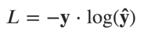
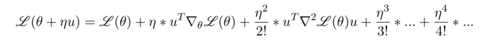
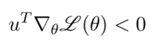
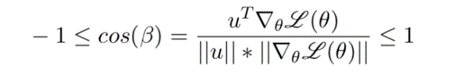
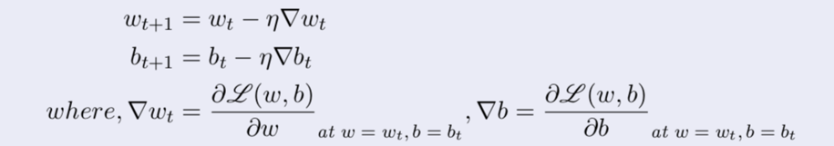

# Thuật toán đạo hàm theo hướng

## Chứng minh

Ta thấy rằng hàm mất mát phụ thuộc vào θ = [w,b] trong đó w là weights là b là bias

Với một θ cho trước, chúng ta có thể thay thử thay đổi một lượng nhỏ Δθ = u và khi đó θ  = θ  + Δθ. Tất nhiên, sẽ tốt hơn khi sử dụng một đối số có thể điểu khiển mà ở đây chúng ta sẽ dùng một learning rate khi đó ta có θ = θ + η.Δθ

Vậy điều gì sẽ xảy ra với L?

Bằng cách khai triển Taylor ta có:

Bỏ qua toán tử từ vị trí thứ 2 trở đi do learning rate thường rất nhỏ nên các giá trị đó gần bằng 0. Khi đó lượng thay đổi của hàm lỗi sẽ là:

Tất nhiên giá trị này phải nhỏ hơn 0 vì chúng đang đang muốn cực tiểu giá trị của hàm lỗi.

Nếu như viết rõ hơn công thức trên, nó sẽ nhìn giống với tích vô hướng của hai vector. Bởi vậy nên chúng ta có thể cực tiểu giá trị trên bằng cách cực tiểu giá trị cos giữa hai vector u và gradient của hàm lỗi

Vì cos giữa hai vector bằng -1 khi hai vector ngược chiều nhau nên chúng ta sẽ cập nhật θ ngược chiều đạo hàm.

## Phương pháp cập nhật

Phương pháp cập nhật đơn giản nhất được trình bày ở dưới đây

Để cập nhật các tham số, chúng ta cần tính tất cả các đạo hàm riêng đối với các thành phần của θ
(tức là weights w và bias ​​b). Để làm được điều đó, các chúng ta có thể dùng phương pháp Auto differentiation.

## Các loại Gradient Decent

Các loại thuật toán Gradient Decent được phân loại dựa trên số lượng dữ liệu mà chúng sử dụng, bao gồm:

### Batch Gradient Descent

Batch gradient descent, còn được gọi là vani gradient descent, tính toán lỗi cho từng ví dụ trong tập dữ liệu huấn luyện, nhưng chỉ sau khi tất cả các ví dụ huấn luyện đã được đánh giá thì mô hình mới được cập nhật. Toàn bộ quá trình này giống như một chu kỳ và nó được gọi là (epoch) kỷ nguyên đào tạo.

Một số ưu điểm của phương pháp giảm độ dốc hàng loạt là tính toán hiệu quả, nó tạo ra độ dốc lỗi ổn định và sự hội tụ ổn định.

Một số nhược điểm là độ dốc lỗi ổn định đôi khi có thể dẫn đến trạng thái hội tụ không phải là tốt nhất mà mô hình có thể đạt được. Nó cũng yêu cầu toàn bộ tập dữ liệu huấn luyện phải ở trong bộ nhớ và có sẵn cho thuật toán.

### Stochastic Gradient Descent

Ngược lại, descent gradient ngẫu nhiên (SGD) thực hiện điều này cho từng ví dụ đào tạo trong tập dữ liệu, có nghĩa là nó cập nhật lần lượt các tham số cho từng ví dụ đào tạo.Tùy thuộc vào vấn đề, điều này có thể làm cho SGD nhanh hơn Batch Gradient Descent.

Một lợi thế là các bản cập nhật thường xuyên cho phép chúng ta có tỷ lệ cải thiện khá chi tiết.

Tuy nhiên, các bản cập nhật thường xuyên đắt hơn về mặt tính toán so với phương pháp giảm dần độ dốc theo lô. Ngoài ra, tần suất của các bản cập nhật đó có thể dẫn đến chuyển màu ồn ào, có thể khiến tỷ lệ lỗi nhảy xung quanh thay vì giảm từ từ

### Mini-Batch Gradient Descent

Mini-Batch Gradient Descent (Giảm độ dốc theo lô nhỏ) là phương pháp phù hợp vì nó là sự kết hợp của các khái niệm về SGD và giảm độ dốc theo lô. Nó chỉ đơn giản là chia tập dữ liệu đào tạo thành các lô nhỏ và thực hiện cập nhật cho từng lô đó. Điều này tạo ra sự cân bằng giữa tính mạnh mẽ của giảm độ dốc ngẫu nhiên và hiệu quả của giảm độ dốc hàng loạt. Kích thước lô nhỏ phổ biến nằm trong khoảng từ 50 đến 256, nhưng giống như bất kỳ kỹ thuật học máy nào khác, không có quy tắc rõ ràng vì nó thay đổi cho các ứng dụng khác nhau. Đây là thuật toán khởi đầu khi đào tạo mạng nơ-ron và nó là kiểu Gradient Descent phổ biến nhất trong học sâu.
