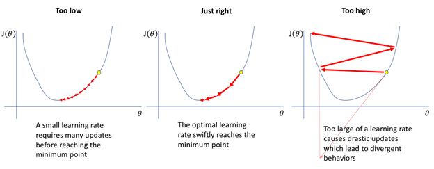
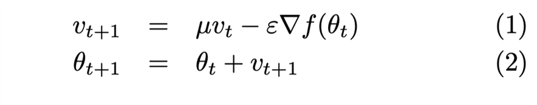
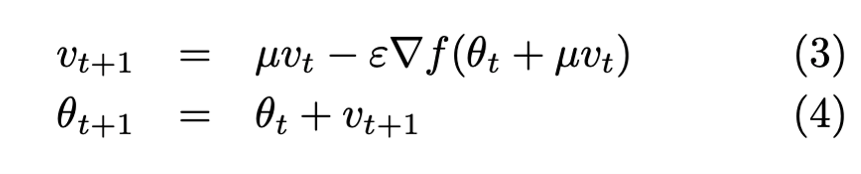
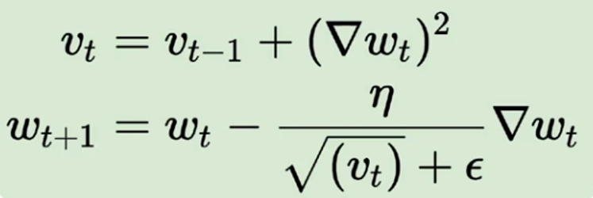
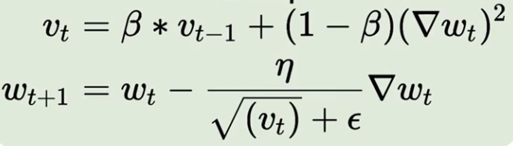
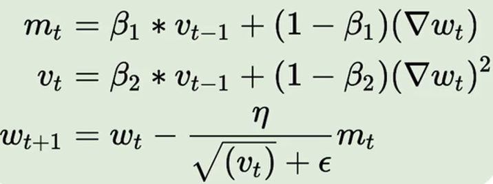

# Các optimizers cho gradient descent thường được sử dụng

Nhắc lại công thức cập nhật của GD, một tham số rất quan trọng cần lưu ý đến là tốc độ học η (learning rate), η sẽ quy định số bước “học” cần thiết cho models. Việc chọn η phù hợp sẽ tùy thuộc vào model và dataset. Nếu η quá nhỏ thì model sẽ mất rất nhiều steps hay iterations để tiến tới các điểm optimal points. Trường hợp η quá lớn thì biến cập nhật sẽ “nhảy” quanh (bounding around) các điểm optimal points và không hội tụ. Có thể minh hoạt như trong hình:

## Momentum gradient descent

Ý tưởng cơ bản của momentum là gia tốc học khi cùng hướng với chiều của gradient và giảm tốc học khi ngược hướng với gradient. Khi momentum của GD đủ lớn thì các biến cập nhật có thể “vượt” qua các local optimal points để hướng đến các điểm global như trong hình. Một tham số quan trọng khi sử dụng momentum là γ, γ trong thực nghiệm thường được chọn là 0.9, hoặc ban đầu chọn γ = 0.5 tới khi ổn định và tăng dần lên 0.9.https://medium.com/@vicohub/thu%E1%BA%ADt-to%C3%A1n-t%E1%BB%91i-%C6%B0u-gradient-descent-21a0a397928

### Các loại Momentum

#### Classical momentum

Luật cập nhật như sau:

#### Nesterov Accelerated gradient

Momentum giúp cải thiện tốt cho Gradient Descent nhưng tại gần vị trí local optima, nó vẫn gặp khó khăn để hội tụ. NAG sẽ giúp tăng tốc độ hội tụ.

Ý tưởng của Nesterov’s Acceleration là cập nhật momentum theo đúng hướng đi của nó hay dự đoán hướng đi của momentum trước một bước. Có thể minh hoạt như trong hình:

Khi đó luật cập nhật sẽ là:

Trong các bài toán thực tế với large-scale dataset như ImageNet hay Google Open Images thì GD with momentum thường được sử dụng nhiều hơn so với Nesterov’s Acceleration. Còn đối với những dataset nhỏ hơn thì chúng ta có thể sử dụng Nesterov’s Acceleration.

> <https://medium.com/@vicohub/thu%E1%BA%ADt-to%C3%A1n-t%E1%BB%91i-%C6%B0u-gradient-descent-21a0a397928>

## Adaptive gradient descent (AdaGrad)

Ý tưởng: Vai trò của các feature trong không gian dữ liệu là khác nhau, do đó nếu cập nhật các feature này với cùng learning rate thì có vẻ không công bằng. Adagrad đưa ra ý tưởng sẽ đặt learning rate thấp hơn cho những feature thường xuyên xuất hiện; learning rate cao hơn cho những feature ít xuất hiện. Điều này khiến cho Adagrad hoạt động tốt với dữ liệu thưa.

Luật cập nhật:

Vấn đề: Trong một số trường hợp learning rate sẽ giảm dần cho tới khi quá nhỏ và thuật toán sẽ không học được thêm gì.

## Root mean square propagation gradient descent (RMSProp)

Giải quyết vấn đề learning rate luôn giảm của Adagrad

Ý tưởng là thay vì cộng tất cả các bình phương của thành phần gradient từ đầu tới thời điểm t, ta chỉ giữ lại w giá trị gần nhất. Thay vì lưu trữ w giá trị này, ta có thể lưu trữ tổng của chúng và update sau mỗi epoch.

Root mean square propagation gradient descent hoặc RMSprop sử dụng cùng một khái niệm về trung bình có trọng số theo cấp số nhân của các gradient giống như gradient descent với xung lượng nhưng sự khác biệt là cập nhật các tham số.

## Adaptive moment estimation (Adam)

Cùng ý tưởng với Adagrad là thay đổi learning rate khác nhau với mỗi feature.

– Thay vì chỉ dùng một thành phần Momentum cho các thành phần gradient, Adam đồng thời sử dụng Momentum cho bình phương của thành phần gradient tại thời điểm ngay trước đó.

